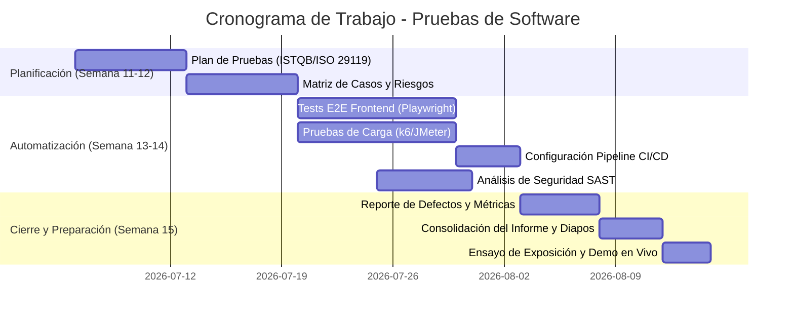

# 📋 Plan de Distribución de Trabajo
## Proyecto Integrador Final - Pruebas de Software (Semana 15)

Este documento detalla la distribución de tareas de desarrollo de software, automatización de pruebas y elaboración de la documentación del proyecto **SmartQueue** para cumplir con el 100% de la rúbrica del curso. El equipo se divide en **4 personas**, asignando responsabilidades balanceadas que integran tanto el desarrollo técnico como la redacción de informes académicos.

---

## 🔍 Resumen del Estado del Proyecto (Avance MVP)

Para contextualizar el trabajo restante, el sistema actual cuenta con:
*   **Backend (FastAPI + SQLAlchemy + SQLite)**: Modelos relacionales con dos relaciones M:N configuradas (Clientes $\leftrightarrow$ Servicios y Operadores $\leftrightarrow$ Ventanillas). API funcional con endpoints asíncronos y WebSockets en tiempo real. Middleware de simulación de Caos (latencia, caídas y fallos transaccionales).
*   **Frontend (React + Vite)**: Vistas funcionales en tiempo real para el Cliente, Operador, Monitor Público (con síntesis de voz / TTS) y Panel SQA (métricas de latencia y configuración de caos).
*   **Suite de Pruebas Inicial (`pytest`)**: Pruebas de integración de la API, pruebas de rollback ACID ante fallos transaccionales y tests para el middleware de caos.

---

## 🎯 Entregables Faltantes según la Rúbrica

Para obtener la máxima calificación (20 puntos / Ponderación: 35%), el equipo debe desarrollar e implementar los siguientes componentes:
1.  **Plan de Pruebas Completo**: Alineado a estándares **ISTQB** e **ISO/IEC 29119** (Rúbrica C2).
2.  **Matriz de Casos de Prueba**: Diseñada mediante técnicas de Caja Negra (particiones de equivalencia, valores límite), Caja Blanca y Pruebas basadas en Riesgos (Rúbrica C3).
3.  **Automatización de Interfaz (E2E)**: Suite automatizada que valide el flujo del frontend usando **Playwright** o **Cypress** (Rúbrica C4).
4.  **Pruebas de Carga y Rendimiento**: Scripts para simular concurrencia y medir latencia bajo condiciones de estrés/caos usando **k6** o **JMeter** (Rúbrica C4).
5.  **Pipeline CI/CD**: Integración de pruebas automáticas en **GitHub Actions** (Rúbrica C4).
6.  **Análisis de Seguridad & DevSecOps**: Pruebas de vulnerabilidades basadas en **OWASP Top 10** y escaneo estático de seguridad (Rúbrica C5).
7.  **Gestión de Defectos y Riesgos**: Matriz de riesgos de producto, bitácora de bugs e interpretación de métricas de calidad (Rúbrica C5 y C7).
8.  **Demo en Vivo y Diapositivas**: Preparación de la defensa y la demostración ante el jurado (Rúbrica C6 y C8).

---

## 👥 Distribución del Trabajo por Persona

A continuación, se define el rol, las tareas técnicas de código y las tareas de documentación asignadas a cada miembro del equipo.

---

### 👤 Persona 1: Líder de Calidad y Automatización E2E (UI Testing)
*Enfocado en asegurar la calidad desde la perspectiva del usuario final y validar los flujos de interfaz.*

#### 🛠️ Tareas de Código (Desarrollo Técnico):
1.  **Configuración del Entorno de Pruebas E2E**: Instalar y configurar **Playwright** (o **Cypress**) en la carpeta `frontend/`.
2.  **Desarrollo de Scripts E2E**: Programar pruebas de extremo a extremo automatizadas para el flujo principal:
    *   *Registro*: El cliente ingresa su DNI y genera un ticket con código QR.
    *   *Llamado*: El operador inicia sesión, se asigna un módulo y llama al siguiente ticket.
    *   *Visualización*: La pantalla de la sala pública se actualiza automáticamente con el ticket llamado y emite sonido.
3.  **Mantenimiento de Dependencias Frontend**: Añadir comandos de ejecución rápida de tests en el `package.json` (`npm run test:e2e`).

#### 📄 Tareas de Rúbrica y Documentación:
*   **Ítem 1 (Presentación del Sistema)**: Redactar la introducción del proyecto, delimitación del alcance, objetivos del sistema y justificación de la evolución técnica del MVP.
*   **Ítem 6 (Guión de la Demo)**: Liderar la preparación del guión técnico y secuencia para la demo en vivo ante el jurado, asegurando que todos los flujos de integración funcionen.
*   **Ítem 7 (Reporte E2E)**: Redactar la sección de resultados de pruebas de interfaz, adjuntando capturas de pantalla y métricas de éxito de la suite UI.

#### 🎙️ Rol en la Exposición:
*   Presentación del alcance, problemática de colas y arquitectura del sistema.
*   Conducir la ejecución en vivo de las pruebas E2E (Playwright/Cypress).

---

### 👤 Persona 2: Arquitecto de APIs e Integración Continua (CI/CD Pipeline)
*Enfocado en la estabilidad del servidor, ampliación del backend y automatización de la integración.*

#### 🛠️ Tareas de Código (Desarrollo Técnico):
1.  **Ampliación de Pruebas Backend (`pytest`)**:
    *   Escribir nuevos tests unitarios y de integración para alcanzar al menos el **85% de cobertura de código**.
    *   Utilizar `pytest-cov` para generar reportes automáticos de cobertura.
2.  **Pipeline CI/CD**:
    *   Diseñar y configurar un workflow de **GitHub Actions** (`.github/workflows/ci.yml`).
    *   El pipeline debe ejecutarse en cada *push* o *pull request*, instalando dependencias con `uv` y `bun`, ejecutando `pytest` (backend) y corriendo las pruebas E2E de la Persona 1 (frontend).
3.  **Automatización de Despliegue de Pruebas**: Configurar reportes automáticos de ejecución en la pestaña *Actions* de GitHub.

#### 📄 Tareas de Rúbrica y Documentación:
*   **Ítem 2 (Plan y Estrategia de Pruebas)**: Diseñar el **Plan de Pruebas formal** alineado a los estándares **ISTQB** e **ISO/IEC 29119** (definir niveles de prueba: unitaria, integración, sistema; y tipos: funcionales y no funcionales).
*   **Ítem 4 (Evidencia de CI/CD)**: Documentar el diseño del pipeline, capturas de pantalla del flujo de ejecución exitoso y estadísticas del reporte de cobertura de código.

#### 🎙️ Rol en la Exposición:
*   Explicar la estrategia y plan de pruebas conceptual (ISTQB/ISO 29119).
*   Mostrar el funcionamiento del pipeline CI/CD en GitHub y las estadísticas de cobertura del código.

---

### 👤 Persona 3: Ingeniero de Rendimiento (Performance) y Diseño de Casos
*Enfocado en evaluar la robustez del sistema bajo estrés, latencia de transacciones ACID y la lógica de diseño de casos.*

#### 🛠️ Tareas de Código (Desarrollo Técnico):
1.  **Desarrollo de Pruebas de Carga**: Crear un script de pruebas en **k6** (o **JMeter**) que simule la creación concurrente de cientos de tickets y llamados de operadores de forma simultánea.
2.  **Pruebas de Rendimiento bajo Caos**:
    *   Ejecutar las pruebas de carga mientras el middleware de Caos inyecta latencia y tasas de fallo.
    *   Medir la degradación de los tiempos de respuesta del backend (endpoints `/api/v1/tickets` y `/api/v1/tickets/call-next`).
3.  **Monitoreo SQA**: Asegurar la correcta captura de las latencias y consumo de recursos en base de datos.

#### 📄 Tareas de Rúbrica y Documentación:
*   **Ítem 3 (Diseño de Casos de Prueba)**: Diseñar la **Matriz de Casos de Prueba** principal usando:
    *   *Caja Negra*: Partición de equivalencia y análisis de valores límite para DNI, celulares y creación de turnos.
    *   *Caja Blanca*: Caminos básicos de las transacciones con rollback en el backend.
    *   *Pruebas basadas en Riesgos*: Matriz de priorización de pruebas enfocada en las relaciones M:N y transacciones críticas.
*   **Ítem 7 (Métricas de Rendimiento)**: Compilar los reportes de k6/JMeter, crear gráficos de percentiles de latencia ($p95$, $p99$), transacciones por segundo (RPS) e interpretar los resultados para proponer mejoras de infraestructura.

#### 🎙️ Rol en la Exposición:
*   Explicar las técnicas utilizadas para el diseño de casos de prueba y mostrar la matriz correspondiente.
*   Presentar los gráficos e interpretación de las pruebas de rendimiento y estrés bajo condiciones de Caos.

---

### 👤 Persona 4: Especialista en Ciberseguridad (SecOps) y Gestión de Riesgos
*Enfocado en mitigar vulnerabilidades, auditar el código estáticamente y mantener el control de calidad integral.*

#### 🛠️ Tareas de Código (Desarrollo Técnico):
1.  **Implementación de Herramientas SAST**:
    *   Configurar y correr **Bandit** para analizar el código de Python y buscar fallas de seguridad comunes.
    *   Ejecutar `npm audit` o configurar **Snyk** en el frontend para detectar vulnerabilidades en las librerías de React.
2.  **Auditoría de Seguridad Dinámica (OWASP)**:
    *   Realizar pruebas de manipulación de payloads, inyección de scripts básicos y validar que el acceso al endpoint de caos `/api/v1/chaos/config` requiera niveles de protección mínimos (o documentar su riesgo).
3.  **Auditoría de Inyecciones SQL**: Validar que el uso de SQLAlchemy evite inyecciones de datos en consultas crudas de base de datos.

#### 📄 Tareas de Rúbrica y Documentación:
*   **Ítem 5 (Riesgos, Defectos y Seguridad)**:
    *   Crear la **Matriz de Riesgos** del software (identificación de riesgos del negocio por caídas de colas).
    *   Documentar el **Análisis de Seguridad** basado en **OWASP Top 10** adaptado al stack (FastAPI + React).
    *   Mantener el **Tablero de Control de Defectos (Bug Log)**, registrando los bugs simulados o reales encontrados durante el desarrollo, su severidad y estado (Abierto, En proceso, Corregido).
*   **Ítem 8 (Conclusiones y Mejoras)**: Consolidar las conclusiones generales sobre el impacto de la estrategia de SQA y compilar la presentación final (diapositivas en PPT/Canva).

#### 🎙️ Rol en la Exposición:
*   Explicar la matriz de riesgos del proyecto y los resultados del análisis de seguridad OWASP.
*   Presentar la gestión del tablero de defectos, las métricas consolidadas del proyecto y las conclusiones finales.

---

## 📊 Matriz Cruzada de Responsabilidades vs Rúbrica

Para asegurar que cada criterio de evaluación tenga un responsable principal y un co-responsable de soporte, se establece la siguiente matriz:

| Criterio de la Rúbrica | Puntaje | Persona Responsable Principal | Persona de Apoyo / Soporte | Entregable Clave Asociado |
| :--- | :---: | :---: | :---: | :--- |
| **C1. Presentación y Alcance** | 2 pts | **Persona 1** | Persona 4 | Diapositivas iniciales e introducción del informe. |
| **C2. Plan y Estrategia** | 3 pts | **Persona 2** | Persona 3 | Plan de Pruebas alineado a ISO 29119 e ISTQB. |
| **C3. Diseño de Casos** | 3 pts | **Persona 3** | Persona 2 | Excel/Matriz de Casos (Caja Negra, Caja Blanca, Riesgos). |
| **C4. Automatización de Pruebas** | 4 pts | **Persona 1** (UI/E2E) **Persona 2** (CI/CD) **Persona 3** (Rendimiento) | Persona 4 | Suite Playwright, workflow de GitHub Actions, scripts k6. |
| **C5. Riesgos, Defectos y Seguridad** | 2 pts | **Persona 4** | Persona 1 | Análisis OWASP, reporte SAST (Bandit/Snyk), Matriz de Riesgos y Bug Log. |
| **C6. Demo en Vivo** | 3 pts | **Persona 1** | Todo el equipo | Script de demo sincronizado en producción/local con visualización en vivo. |
| **C7. Documentación y Métricas** | 2 pts | **Persona 4** | Todo el equipo | Consolidación del informe final e interpretación de KPIs técnicos de SQA. |
| **C8. Comunicación y Exposición** | 1 pt | Todo el equipo | Todo el equipo | Exposición oral coordinada, vestimenta formal y defensa de preguntas. |

---

## 📅 Cronograma e Hitos Recomendados

Para asegurar el éxito en la **Semana 15**, se sugiere el siguiente calendario de trabajo:

---

> [!IMPORTANT]
> **Participación Equilibrada**: La rúbrica penaliza severamente el desbalance en la participación durante la defensa final (C8). Todos los integrantes deben ser capaces de responder preguntas técnicas sobre cualquiera de los módulos desarrollados (ej: Persona 1 debe entender el pipeline CI/CD, Persona 4 debe entender cómo correr los tests E2E, etc.). Se recomienda realizar al menos dos simulacros de exposición internos antes de la presentación final.
